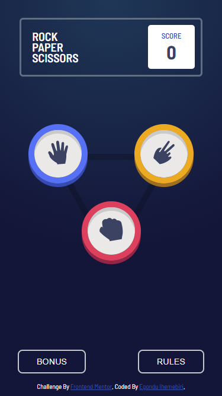

# Frontend Mentor - Rock, Paper, Scissors solution

This is a solution to the [Rock, Paper, Scissors challenge on Frontend Mentor](https://www.frontendmentor.io/challenges/rock-paper-scissors-game-pTgwgvgH). Frontend Mentor challenges help you improve your coding skills by building realistic projects.

## Table of contents

- [Overview](#overview)
  - [The challenge](#the-challenge)
  - [Screenshot](#screenshot)
  - [Links](#links)
- [My process](#my-process)
  - [Built with](#built-with)
- [Author](#author)

## Overview

### The challenge

Users should be able to:

- View the optimal layout for the game depending on their device's screen size
- Play Rock, Paper, Scissors against the computer
- Maintain the state of the score after refreshing the browser
- **Bonus**: Play Rock, Paper, Scissors, Lizard, Spock against the computer

### Screenshot

### Links

- Solution URL: [SolutionURL]([https://github.com/ihemebiriegondu/rock-paper-scissors-challenge.git](https://www.frontendmentor.io/solutions/rock-paper-scissors-challenge-with-reactjs-UK67ILqoz5))
- Live Site URL: [LiveSite](https://rock-paper-scissors-challenge-orcin.vercel.app/)

## My process

### Built with

- CSS custom properties
- Flexbox
- CSS Grid
- [React](https://reactjs.org/) - JS library

## Author

- Website - [Egondu](https://egonduihemebiri.vercel.app)
- Frontend Mentor - [@ihemebiriegondu](https://www.frontendmentor.io/profile/ihemebiriegondu)
- Twitter - [@egondu_i](https://twitter.com/egondu_i?s=09)
